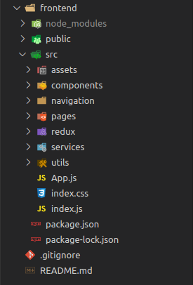
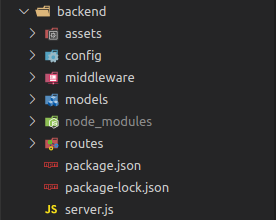

# Case Mind Consulting

## Tabela de Conteúdos

1. [O Case](##O%20Case)
2. [Design das Telas](##Design%20das%20Telas)
3. [Como rodar](##Como%20rodar)
4. [Front-end](#Front-end)

   - [Tecnologias Utilizadas](##Tecnologias%20Utilizadas)
   - [Estrutura de pastas](##Estrutura%20de%20pastas)

5. [Back-end](#Back-end)

   - [Tecnologias Utilizadas](##Tecnologias%20Utilizadas)
   - [Estrutura de pastas](##Estrutura%20de%20pastas)

## O Case

A proposta do Case era criar uma plataforma para que os usuários pudessem se cadastrar, logar e editar suas informações. Os usuários possuem níveis de acesso e tem visões diferentes da plataforma dependendo de seu nível. O usuário pode cadastrar Nome, Email, Cpf, Senha, Imagem de perfil e Nível de acesso.

O projeto foi dividido em duas partes, o frontend e o backend. Foi utilizada a stack Javascript para o desenvolvimento de ambas as partes. As tecnologias utilizadas serão citadas.

## Design das telas

Foram desenvolvidas quatro telas: Login, Cadastro, DashboardUsuário e DashboardAdmin. Para a criação do design foram utilizados:

- [Figma](https://www.figma.com/)

  ```
  Ferramenta de edição online.
  ```

  [Link para o projeto](https://www.figma.com/file/cSKoyaVUFERplGkvF0lp5R/Case-Mind-consulting?node-id=83%3A0).

- [FontJoy](https://fontjoy.com/)
  ```
  Website para escolher tipografia.
  ```
- [ColorHunt](https://colorhunt.co/)
  ```
  Website para escolher paleta de cores.
  ```
- [Patternpad](https://patternpad.com/editor.html)
  ```
  Ferramenta que cria padrões variados para serem utilizados como parte do layout.
  ```
- [Icons8](https://icons8.com/illustrations)
  ```
  Site com ilustrações gratuitas para utilização.
  ```

## Como rodar

Para inicializar a aplicação, é necessário clonar o repositório do projeto para sua máquina.É necessário ter instalado o npm. Depois são realizados dois comandos:

- ## frontend

  Abrir o terminal na pasta frontend e executar

  ```
  npm start
  ```

  . Isso abrirá uma aba em seu navegador com o endereço localhost:3000.

- ## backend

  Abrir o terminal na pasta backend e digitar o comando

  ```
  npm run server
  ```

  . Isso irá inicializar o servidor local na porta 5000, onde as requisições para a API são feitas.

# Front-end

O Front-end foi iniciado através do CRA (Create-React-App) que deu a estrutura inicial do projeto e alguns arquivos úteis.

## Tecnologias utilizadas

As seguintes tecnologias foram utilizadas no desenvolvimento:

- ### [Material-UI core](https://material-ui.com/)
  ```
  Componentes React que seguem o Material Design da google.
  ```
- ### [Axios](https://www.npmjs.com/package/axios)
  ```
  Cliente HTTP baseado em Promises para fazer requisições.
  ```
- ### [React-Redux](https://react-redux.js.org/)
  ```
  Biblioteca resposável por "grudar" o React com o Redux.
  ```
- ### [React-Router-Dom](https://www.npmjs.com/package/react-router-dom)
  ```
  Permite roteamento no lado do cliente. Sendo possível criar páginas com navegação interna que não precisam recarregar.
  ```
- ### [Redux](https://redux.js.org/)
  ```
  Biblioteca de gerenciamento de estado para manter o estado da aplicação centralizado.
  ```

## Estrutura de pastas

As pastas foram organizadas para facilitar a gestão de arquivos com funções semelhantes, ficando da seguinte forma:



- ### assets
  ```
  Pasta que contém as imagens utilizadas.
  ```
- ### components
  ```
  Pasta com os componentes globais da aplicação.
  ```
- ### navigation
  ```
  Pasta que mantem as Rotas da aplicação.
  ```
- ### pages
  ```
  Páginas
  ```
- ### redux
  ```
  Abriga a store, types, actions e reducers da aplicação.
  ```
- ### services
  ```
  Pasta com funções que fazem chamadas à API
  ```
- ### utils
  ```
  Funções de auxílio
  ```

# Back-end

O Back-end foi desenvolvido em NodeJs utilizando ExpressJs.

## Tecnologias utilizadas

As seguintes tecnologias foram utilizadas no desenvolvimento:

- ### [NodeJS](https://nodejs.org/)
  ```
  Ambiente de execução do JavaScript.
  ```
- ### [ExpressJS](https://expressjs.com/pt-br/)
  ```
  Framework enxuto com diversos recursos.
  ```
- ### [Config](https://www.npmjs.com/package/config)
  ```
  Cuida da configuração da aplicação para produção
  ```
- ### [Bcrypt](https://www.npmjs.com/package/bcrypt)
  ```
  Biblioteca de criptografia para Node.
  ```
- ### [Express-validator](https://express-validator.github.io/)
  ```
  Middleware para validação de campos
  ```
- ### [Mongoose](https://mongoosejs.com/)
  ```
  Solução para modelagem do banco de dados
  ```
- ### [JsonWebToken (JWT)](https://jwt.io/)
  ```
  Padrão para autorização e autenticação.
  ```
- ### [MongoDBAtlas](https://www.mongodb.com/cloud/atlas)
  ```
  Serviço de banco de dados em núvem
  ```
  - ### [Postman](https://www.postman.com/)
  ```
  Ferramenta para teste das rotas
  ```

## Estrutura de pastas



- ### assets
  ```
  Contem imagens utilizadas
  ```
- ### config
  ```
  Contem configurações como o segredo do token e a url do banco de dados.
  ```
- ### middleware
  ```
  Middleware's utilizados nas rotas
  ```
- ### models
  ```
  Modelos do banco de dados.
  ```
- ### routes
  ```
  Rotas e seus endpoints.
  ```

## Rotas

Ao todo, foram desenvolvidas 3 rotas, sendo no total 6 caminhos ou endpoints.

As rotas feitas foram para o login, cadastro, atualização e remoção do acesso dos usuários.
